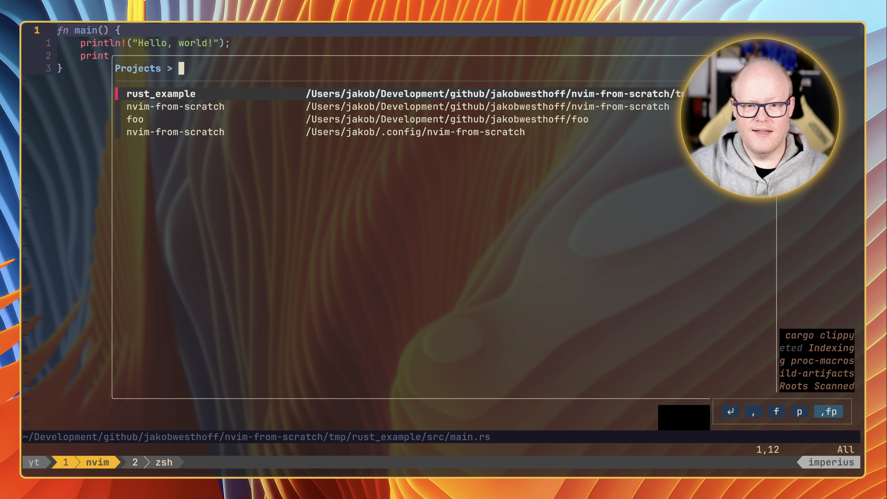

# 🔍 project-fzf.nvim

A Neovim plugin that provides FZF-based project selection for project.nvim.

This plugin replicates the Telescope integration from project.nvim but uses fzf-lua instead. It combines the power of [project.nvim](https://github.com/ahmedkhalf/project.nvim) with [fzf-lua](https://github.com/ibhagwan/fzf-lua) to create a smoother project navigation experience.

<div align="center">
  
</div>

This plugin was developed live on the [MrJakob YouTube channel](https://www.youtube.com/watch?v=7pCTdGudokA) as part of a Neovim plugin development series.

## ✨ Features

- Display and navigate through your project.nvim projects using fzf-lua
- Quickly open files, search in project, or view recent files
- Delete projects from history
- Change directory to the selected project

## 📋 Requirements

- [project.nvim](https://github.com/ahmedkhalf/project.nvim) (must be configured separately before using this plugin)
- [fzf-lua](https://github.com/ibhagwan/fzf-lua)

## 📥 Installation

### Using [lazy.nvim](https://github.com/folke/lazy.nvim)

```lua
{
  'jakobwesthoff/project-fzf.nvim',
  dependencies = {
    'ahmedkhalf/project.nvim', -- Must be configured separately
    'ibhagwan/fzf-lua',
  },
  opts = {},  -- Will call require('project-fzf').setup(opts)
}
```

### Using [packer.nvim](https://github.com/wbthomason/packer.nvim)

```lua
use {
  'jakobwesthoff/project-fzf.nvim',
  requires = {
    'ahmedkhalf/project.nvim', -- Must be configured separately
    'ibhagwan/fzf-lua',
  },
  config = function()
    -- Setup project-fzf
    require('project-fzf').setup()
  end
}
```

### Using [vim-plug](https://github.com/junegunn/vim-plug)

```vim
Plug 'ahmedkhalf/project.nvim'  " Must be configured separately
Plug 'ibhagwan/fzf-lua'
Plug 'jakobwesthoff/project-fzf.nvim'

" In your init.vim after plugins are loaded:
" lua << EOF
" require('project-fzf').setup()
" EOF
```

## 🔧 Manual Setup

If you need more control over the configuration, you can set up the plugin manually:

```lua
-- Assuming project.nvim is already configured elsewhere
require('project-fzf').setup()
```

## 🚀 Usage

### Commands

- `:ProjectFzf` - Open the project selector

### Keybindings in FZF Selector

When the project selector is open, you can use the following keybindings (which closely match those used in the project.nvim Telescope integration):

- `Enter` - Select project and open file browser
- `Ctrl-s` - Select project and open live grep search
- `Ctrl-r` - Select project and browse recent files
- `Ctrl-d` - Delete project from history
- `Ctrl-w` - Select project and just change directory

### Custom Keybinding Example

Add to your Neovim configuration:

```lua
-- Map <leader>fp to open projects
vim.keymap.set('n', '<leader>fp', ':ProjectFzf<CR>', { noremap = true, silent = true })
```

## 📄 License

[MIT](./LICENSE)

## 👏 Credits

Inspired by the project management functionality in [project.nvim](https://github.com/ahmedkhalf/project.nvim).
